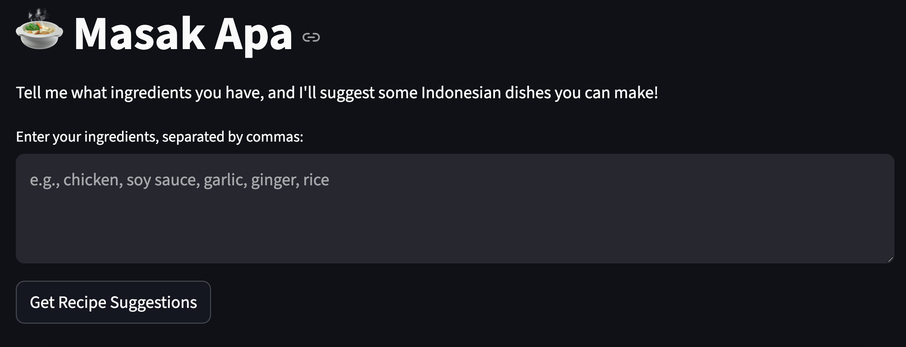

# 🍲 Masak Apa AI

A Streamlit app that suggests Indonesian recipes based on ingredients you provide. It uses a locally-run `deepseek-r1` model via Ollama to generate real-time, streaming responses.



---

## 🚀 Getting Started

### Prerequisites

-   Python 3.8+
-   Ollama installed and running.
-   The `deepseek-r1` model pulled via Ollama (`ollama pull deepseek-r1`).

### Installation

1.  **Clone the repository:**
    ```bash
    git clone [https://github.com/sirfindcent/masak-apa-ai.git](https://github.com/sirfindcent/masak-apa-ai.git)
    cd masak-apa-ai
    ```

2.  **Set up a virtual environment:**
    ```bash
    # For macOS/Linux
    python3 -m venv venv
    source venv/bin/activate

    # For Windows
    python -m venv venv
    .\venv\Scripts\activate
    ```

3.  **Create a `requirements.txt` file** with the following content:
    ```
    streamlit
    ollama
    ```

4.  **Install dependencies:**
    ```bash
    pip install -r requirements.txt
    ```

5.  **Run the app:**
    ```bash
    streamlit run app.py
    ```

---

## 🛠️ Tech Stack

-   **Language:** Python
-   **Framework:** Streamlit
-   **LLM Engine:** Ollama (`deepseek-r1`)
